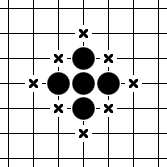
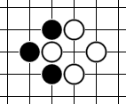

# 2021 HAI RL Arena
2021년 2학기 한양대학교 인공지능 동아리 HAI에서 열린 따목 대회 깃허브 저장소입니다.

## 게임 용어
- 바둑판: 게임이 진행되는 격자모양의 판.
- N선: 바둑판에서 N번째로 가장자리에 위치한 선.
- 착수: 바둑판에 돌을 놓는 행위.
- 돌무리: 한 가지 색으로 사이에 빈칸 없이 이어진 돌의 집단.
- 활로: 돌(무리) 주변 상하좌우 한 칸 중 비어있는 칸.
- 단수: 돌(무리)가 활로가 한 개인 상황.
- 패: 양쪽 돌이 한 개씩 단수로 몰린 상태로, 서로 번갈아 잡으려는 형태.

  
<위 그림에서 ×표시된 부분이 검은 돌무리의 활로이다.>

  
<위 모양을 패라고 한다.>

## 게임 규칙
- 시간은 한 사람당 15분 제한으로, 주어진 15분을 다 사용한 순간 시간초과로 패배한다.
- 가로 세로 19줄의 바둑판에서 진행된다.
- 2명이 번갈아가며 교차점에 돌을 하나씩 착수한다.
- 검은 돌을 가진 사람이 먼저 착수한다.
- 가로, 세로, 또는 대각선으로 7개를 연달아 놓으면 승리한다.
  - 단, 검은 돌을 쥔 플레이어의 경우 8개 이상을 연달아 놓으면 패배한다.
  - 흰 돌을 쥔 플레이어는 8개 이상을 놓아도 승리로 간주한다.
  - 1선과 2선에 놓인 돌은 개수를 셀 때 제외한다.
    - 검은 돌이 8개 이상을 놓을 시 패배하는 규칙의 적용에서는 적용하지 않는다.
- 활로가 없는 돌무리의 경우 들어낼 수 있다.(판에서 제거할 수 있다).
  - 상대방이 바로 직전에 따낸 패는 바로 되따낼 수 없다.
  - 유효한 패이거나 게임을 이길 수 없다면 자살수는 둘 수 없다.
